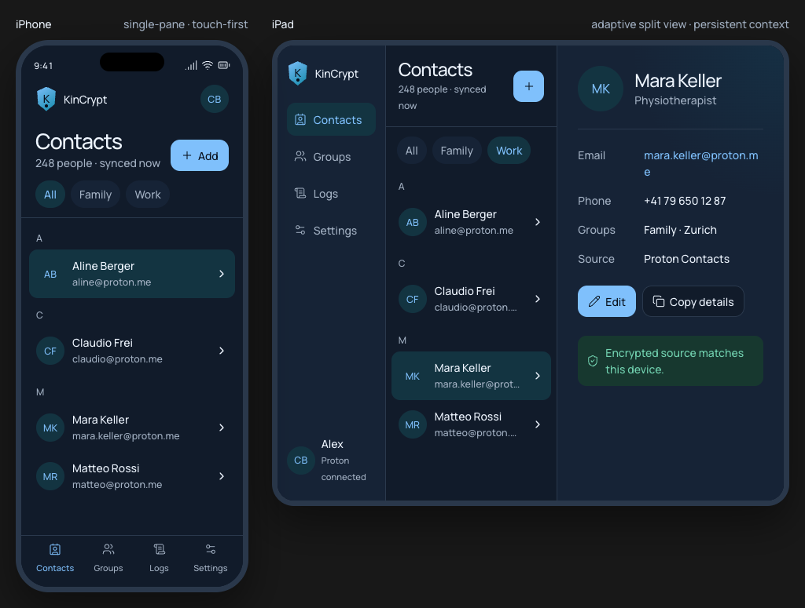

# KinCrypt Design System

Status: baseline for new UI work.

KinCrypt is a mobile-native Flutter contact manager. Proton is the source of truth for contact data. The interface must keep contacts and groups prominent while authentication, encryption, synchronization, and logging remain clear but visually secondary.

## Product principles

1. **Contacts first.** Lead with people, groups, and editable contact data. Infrastructure state must not dominate normal use.
2. **Trust through clarity.** Show the current source and synchronization state in plain language. Never imply that a write is saved or synchronized before it is confirmed.
3. **Dense, not crowded.** Use flat lists, stable alignment, and restrained separators. Avoid dashboard cards around ordinary content.
4. **Touch first.** Every primary interaction must work comfortably without a pointer, hover, context menu, or hardware keyboard.
5. **Adaptive, not stretched.** Phone and tablet layouts express the same information architecture through different navigation and pane structures.
6. **Platform-aware, product-consistent.** Respect safe areas, system gestures, text scaling, keyboard behavior, and route conventions while preserving KinCrypt's identity across iOS and Android.

## Platform hierarchy

The implementation priority is:

1. Modern iPhone and Android phones.
2. iPad and Android tablets.
3. macOS through the iPad compatibility layer. macOS uses the iPad layout and must not introduce a separate desktop information architecture.

Pointer and keyboard support improve the tablet and macOS experience, but must never be required to discover or operate functionality.

## Adaptive layout model

Use available logical width from `LayoutBuilder`, not device names or orientation checks. Treat the values below as starting points; validate them against real content and text scaling.

| Width class | Suggested width | Layout |
| --- | ---: | --- |
| Compact | `< 600 dp` | Single-pane navigation. Bottom navigation for top-level destinations. Detail, create, and edit screens are pushed as full-screen routes. |
| Medium | `600–839 dp` | Navigation rail or compact sidebar plus a list/detail split when both panes remain usable. Collapse to a single content pane before compressing rows or typography. |
| Expanded | `>= 840 dp` | Persistent sidebar, contact or group list, and detail pane. Keep selection and surrounding context visible. |

### Phone behavior

- Use one primary content pane.
- Keep the screen title, count, quiet sync state, and primary create action in the top region.
- Place Contacts, Groups, and Settings in bottom navigation. Logs are reached through Settings.
- Open contact and group details as routes. Preserve list position, selected group, and scroll state when returning.
- Open create and edit operations as full-screen routes. Keep the save action visible when the software keyboard is open.
- Use the platform back gesture and back button. Do not create a parallel custom back pattern.

### Tablet and macOS compatibility behavior

- Default to a persistent sidebar, list pane, and detail pane when width allows.
- Keep the selected list item visibly associated with the detail pane.
- Collapse the sidebar to a rail at medium widths before removing the detail pane.
- If the list and detail cannot both remain readable, use a sidebar plus one routed content pane.
- Create and edit operations may replace the detail pane. Use a modal only for short, bounded actions; do not place comprehensive contact editing in a small dialog.
- Keep touch-sized targets on macOS. Hover states may supplement, but never replace, visible state or labels.

## Information architecture

Primary destinations:

- **Contacts:** grouped contact list, contact details, and contact CRUD.
- **Groups:** grouped group list, group details, contained contacts, and group CRUD.
- **Settings:** application preferences, initially contact sort ordering, plus access to diagnostic logs.

Authentication is a separate entry flow and is not part of primary navigation.

## Visual identity

### Name

Use **KinCrypt** as the product name. Keep capitalization consistent.

### Mark

The visual direction simplifies the current shield, `K`, contact, and keyhole combination into a shield-shaped `K` mark with a small keyhole dot. This preserves recognition at small sizes and removes internal detail that becomes noisy in navigation bars and launch surfaces.

`assets/icon.png` remains the current production asset until a replacement mark is approved and exported at all required platform sizes.

### Character

- Calm rather than clinical.
- Secure rather than defensive.
- Precise rather than technical.
- Contemporary without relying on decorative effects.

## Color

Implement colors as semantic theme tokens. Do not reference raw palette values from widgets.

| Token | Light | Dark | Usage |
| --- | --- | --- | --- |
| `brandVault` | `#123674` | `#7BC1FF` | Strong brand emphasis, active text, primary actions. |
| `brandSignal` | `#0789A8` | `#29AFC5` | Brand gradient, identity accents, limited highlights. |
| `textPrimary` | `#17243D` | `#EDF5FF` | Primary text and icons. |
| `textMuted` | `#506075` | `#A2B1C4` | Metadata, timestamps, secondary labels. |
| `canvas` | `#F3F6FA` | `#07101C` | App background outside primary surfaces. |
| `surface` | `#FFFFFF` | `#101B2B` | Main screen and pane surfaces. |
| `surfaceSoft` | `#E8EEF5` | `#152337` | Sidebars, secondary regions, inactive controls. |
| `divider` | `#C5D0DE` | `#29394E` | Structural dividers and field borders. |
| `selectedSurface` | `#BEDFE9` | `#123442` | Selected rows, active navigation, selected chips. |
| `success` | `#287B62` | `#71D3AE` | Confirmed synchronized state. |
| `successSurface` | `#E4F4EE` | `#17382F` | Low-emphasis success background. |
| `warning` | `#93631B` | `#EFBD67` | Pending local change or recoverable warning. |
| `warningSurface` | `#FFF3D8` | `#392D19` | Low-emphasis warning background. |
| `danger` | `#B44C59` | `#FF8E9A` | Destructive actions, validation failure, sync failure. |
| `dangerSurface` | `#FBECEF` | `#3D2028` | Low-emphasis error background. |

Color rules:

- Reserve `brandVault` for the main action, active destination, or selected state. Do not use it as decoration on every component.
- Use `brandSignal` mainly inside the mark and for restrained identity accents.
- Keep large areas neutral. Contact data must carry more visual weight than app chrome.
- Use semantic status colors only when the state is real and actionable.
- Pair status color with text and, when useful, an icon. Never communicate state through color alone.
- Validate text and icon contrast against WCAG AA in both themes.

## Typography

Primary family: **Manrope**.

Fallback: `Avenir Next`, `Segoe UI`, then the platform sans-serif family.

Use weights `400` and `500` only. Hierarchy comes from size, spacing, and placement rather than heavy weight.

| Role | Size / line height | Weight | Usage |
| --- | --- | --- | --- |
| Display | `40 / 44` | `500` | Authentication and rare identity-led surfaces. |
| Screen title | `28 / 34` | `500` | Phone screen titles. |
| Section title | `20 / 28` | `500` | Tablet pane titles and major sections. |
| List primary | `16 / 22` | `500` | Contact names, group names, primary settings labels. |
| Body | `14 / 20` | `400` | Contact values, explanatory text, form content. |
| Button | `14 / 20` | `500` | Text buttons and primary actions. |
| Metadata | `12 / 16` | `400` | Counts, timestamps, sync details, secondary contact values. |

Typography rules:

- Support platform text scaling. Test at the default size and at least 200% scaling.
- Allow labels and values to wrap before truncating them.
- Truncate only repeated secondary values in constrained list panes. Full details must remain readable in the detail view.
- Use tabular figures for timestamps, counters, one-time codes, and aligned numeric logs.
- Use a platform monospace font for raw log payloads, identifiers, and stack traces only.

## Spacing and geometry

Base spacing scale: `4, 8, 12, 16, 24, 32` logical pixels.

- Phone horizontal screen padding: `16`.
- Tablet pane padding: `20–24`.
- Default component gap: `8` or `12`.
- Major section gap: `24` or `32`.
- Comfortable contact row height: at least `56`.
- Compact row height: at least `48`, used only when the available width and platform justify higher density.
- Minimum effective touch target: `48 × 48` where possible; never below `44 × 44`.
- Default container radius: `16`.
- Buttons and interactive rows: `12`.
- Chips: fully rounded.

Lists remain flat. Do not place every row inside an elevated card. Use spacing, alignment, selection fill, and quiet horizontal dividers to express structure.

## Elevation

Use elevation only to communicate real layering:

- No shadow on ordinary rows, lists, sidebars, or detail panes.
- Soft shadow on modal sheets, popovers, and floating surfaces.
- Stronger shadow may frame device-level overlays such as authentication challenges.
- Never combine heavy borders and heavy shadows on the same surface.

## Navigation

### Phone

Use a bottom navigation bar for Contacts, Groups, and Settings. Use icon and visible label together. The active destination uses `brandVault`; inactive destinations use `textMuted`. Open diagnostic logs from Settings rather than adding a fourth destination.

### Tablet

Use a labeled sidebar at expanded widths and a rail at medium widths. The active destination uses `selectedSurface` with `brandVault` content. Navigation must not shift position when content changes.

### Selection and routing

- Phone list selection opens a detail route.
- Tablet list selection updates the adjacent detail pane.
- When a tablet layout collapses to a phone layout, preserve the selected entity and present it as the active route.
- Deep links must resolve to the same entity regardless of width class.

## Core components

### App mark and account identity

Use the compact mark in navigation chrome. Keep account identity low emphasis. Account state must not compete with the current screen title.

### Primary action

Each action group has at most one filled primary action. Typical examples are Add, Save, Continue, Verify, and Edit. Secondary actions use a neutral surface or text treatment.

### Group chips

Group chips filter the current list. Keep them horizontally compact and wrap only when necessary. Selected chips use `selectedSurface` and `brandVault` text. Do not assign a different color to every group by default.

### Contact row

A contact row contains:

- Avatar or initials.
- Contact name.
- One secondary identifier, normally the primary email address.
- A disclosure indicator on single-pane layouts.

On tablets, the selected row uses `selectedSurface`. Do not add a disclosure indicator when the adjacent detail pane already communicates the result.

### Avatar

Use a quiet circular `selectedSurface` avatar with `brandVault` initials when no photo exists. Contact photos must preserve aspect ratio and should not receive decorative rings.

### Fields

Labels remain visible above editable fields. Do not rely on placeholder text as the only label. Validation appears next to the relevant field and is summarized near the save action when several fields fail.

### Sync state

Normal synchronized state is a short metadata line or low-emphasis success notice. Syncing, pending local changes, offline state, and failure must use distinct text. Avoid permanent progress indicators when no sync is active.

## Screen guidance

### Authentication

Authentication is a focused sequence:

1. Proton credentials.
2. Human verification when Proton requires it.
3. One-time code when enabled.

Show one stage at a time on phones. On tablets, center a bounded authentication surface without expanding fields across the full width. Keep the current stage and reason visible. Never imply that KinCrypt can bypass Proton verification.

### Boot and session resolution

Use `/boot` as the first Flutter route while the native layer resolves the stored session. Keep the screen visually quiet: KinCrypt identity, one indeterminate startup state, and no application navigation. Replace the route with `/contacts` for an authenticated session or `/login` otherwise so `/boot` never remains in the back stack.

The normal synchronization indicator is absent on `/boot`. Authentication state is not contact synchronization state. Show a retry action only after a recoverable startup failure and avoid imposing an artificial minimum splash duration.

### Contact list and details

- Group contacts alphabetically using quiet sticky letter headers.
- Show the total contact count and a concise sync state near the title.
- Keep Add visible without using a Material floating action button.
- Phone uses a list route followed by a detail route.
- Tablet uses sidebar, list, and detail panes when space permits.
- The detail view leads with identity, then communication fields, groups, source, actions, and sync state.
- On phone, the detail route omits bottom navigation and uses the platform back action.
- Email, phone, address, and website rows launch the appropriate platform application from the row while exposing a separate visible Copy action.
- Keep Edit and Favorite above the fold. Separate Delete at the end of the detail content and require confirmation.

### Contact create and edit

- Phone uses a full-screen form route.
- Tablet replaces the detail pane with the form where practical.
- Group related fields without turning every group into a card.
- Keep Save explicit. Warn before discarding unsaved changes.
- Destructive actions are visually separated from Save and require confirmation.
- After saving, display local persistence and Proton synchronization as separate states when they do not complete together.
- Keep Cancel and Save visible above the software keyboard. Confirm Cancel or back when the draft is dirty.
- Model email, phone, address, note, photo, website, role, and logo values as ordered repeatable entries.
- Treat field types as editable text with suggestions rather than closed enumerations. Preserve custom email, phone, and address type labels.
- The editor reports clean, unsaved, saving, or failed draft state separately from the shared sync indicator, which refers only to the last saved contact version.

### Group list and details

Use the same adaptive pattern as contacts. Group rows show the group name and contact count. The detail view shows the group identity, contained contacts, edit action, and sync state. Reuse contact rows inside the group detail instead of inventing a second contact-list pattern.

### Settings

Use grouped form rows on phones and a compact settings pane on tablets. The contact sort-order setting must include an immediate textual preview of the resulting order. Keep advanced and diagnostic settings separate from everyday preferences.

- Show the authenticated Proton account and one explicit Log out action. The Settings action and app-shell avatar action call the same logout operation.
- Persist sort-order and display-order changes immediately, restoring the previous value if persistence fails.
- Use segmented controls for short two-option choices and radio rows when text scaling or localization makes segments cramped.
- Open Logs as a separate pushed screen. Logs remain outside primary navigation.

### Logs

Replace the default Talker presentation with KinCrypt surfaces and typography while preserving complete diagnostic content.

Logs are opened from a diagnostic entry inside Settings. They are not a primary navigation destination.

- Use monospace only for the log message, payload, identifiers, and stack traces.
- Keep timestamp, severity, source, and message aligned and selectable.
- Severity uses semantic color plus a visible label.
- Long payloads expand in place or open a detail route/pane.
- Preserve text selection and copy behavior.
- Never hide errors solely to make the screen appear cleaner.

## Interaction states

Every data-bearing screen must define:

- Initial loading.
- Empty state.
- Loaded state.
- Refreshing or synchronizing state.
- Offline or stale state.
- Recoverable error.
- Blocking error.
- Pending local changes.
- Successful save with synchronization pending.
- Successful synchronization.

State changes must preserve context. Do not replace an existing contact list with a full-screen spinner during refresh.

## Motion

- Prefer platform-native route and sheet transitions.
- Use short `150–250 ms` transitions for selection, expansion, and pane updates.
- Do not animate initial list population item by item.
- Avoid looping decorative motion.
- Respect reduced-motion settings.

## Accessibility

- Provide semantic labels for every icon-only action.
- Keep essential actions and state visible without hover.
- Preserve a logical reading and keyboard focus order across adaptive pane changes.
- Support screen readers, switch control, hardware keyboards, and visible focus on tablets and macOS.
- Do not disable system text scaling.
- Test with long names, long email addresses, translated labels, and large text.
- Do not encode synchronization, severity, validation, or selection with color alone.
- Announce meaningful asynchronous changes without repeatedly announcing background progress.

## Flutter implementation baseline

- Centralize semantic colors, typography, spacing, radii, and elevation in theme extensions or equivalent immutable token classes.
- A Flutter `ColorScheme` may carry semantic colors, but stock Material component appearance is not the visual baseline.
- Build shared KinCrypt components for contact rows, group chips, primary actions, sync state, pane headers, fields, and navigation destinations.
- Use `LayoutBuilder` and available logical width for adaptive decisions.
- Use `SafeArea` and account for display cutouts, gesture insets, and the software keyboard.
- Preserve navigator state for each top-level destination on phones.
- Keep entity selection state independent from pane presentation so layout changes do not lose context.
- Use platform route semantics and keyboard shortcuts without forking the product into unrelated iOS and Android designs.
- Keep widget-specific raw colors, arbitrary spacing, and one-off text styles out of feature code.

## Reference assets

- Current production icon: `assets/icon.png`.
- Approved adaptive contact-screen direction: `design/contacts-iphone-ipad.png`.
- iPhone contact-list specification and widget inventory: `design/contact-list-iphone.md`.
- iPhone contact-detail specification and incremental widget inventory: `design/contact-detail-iphone.md`.
- iPhone contact-editor specification and incremental widget inventory: `design/contact-edit-iphone.md`.
- iPhone group-list and group-detail specification: `design/group-view-iphone.md`.
- iPhone settings specification and incremental widget inventory: `design/settings-iphone.md`.
- iPhone boot-screen specification and incremental widget inventory: `design/boot-screen.md`.

The screenshot is a visual reference, not a pixel-perfect specification. System insets, text metrics, and platform behavior take precedence over copying device chrome from the mockup.
